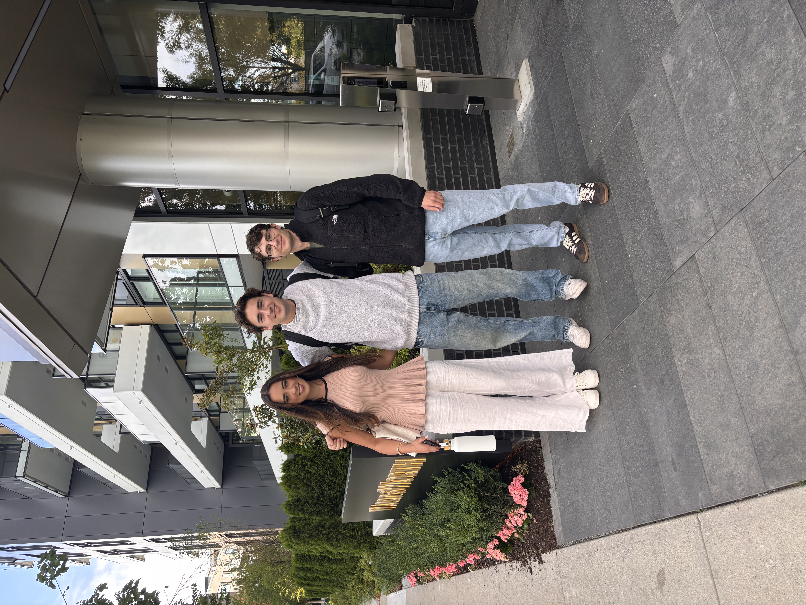

## Orientation

The first three days of MDS were spent in orientation. I was able to meet many new friends and spend time with some old friends. We did many activities such as the Goose Hunt and hearing from multiple alumni of the program. The orientation got myself and my peers off to a great start in the MDS program.

## First Week Classes

The start of lectures came and went quickly. I was able to review many concepts from my undergraduate and job experiences as well as begin venturing into many new learnings. I continued to spend time with many friends from orientation which was nice. Many of the labs were intensive, however I was able to learn and teach my peers and get everything completed for week 1's courses.

## Upcoming

This week I am learning many new concepts in Python, Github, R and Probability. Next week is our first quiz week so I will have to start preparing my cheatsheets and study materials leading into the weekend.

